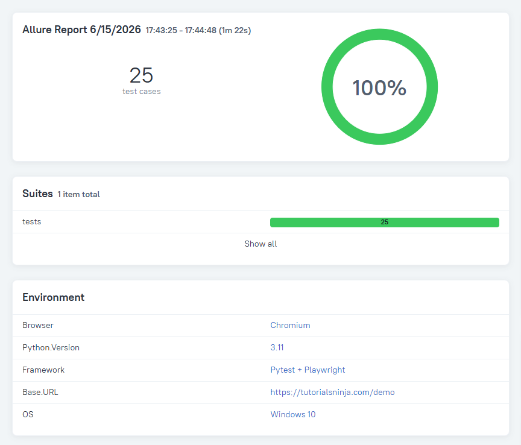

# 🌐 Web Browser Automation


An end-to-end test automation framework for the [TutorialsNinja demo store](https://tutorialsninja.com/demo/index.php), built with **Python**, **Playwright** and **Pytest** using the **Page Object Model (POM)** design pattern.

---

## 📊 Test Report



---

## ✨ Features

- 🏗️ **Page Object Model** — clean, maintainable and scalable architecture
- 🔦 **Element highlighting** on interaction for easy visual debugging
- ⚙️ **Centralized configuration** via `config.ini`
- 📊 **Allure Reports** — detailed test reports with environment info
- 🧪 **25 automated tests** covering: login, cart, products, search, wish list, contact, user registration and account details

---

## 📁 Project Structure

```
web-browser-automation/
├── pages/                      # Page Object classes
│   ├── base_page.py            # Shared actions (click, fill, highlight)
│   ├── header.py               # Header & navigation component
│   ├── login_page.py
│   ├── cart_page.py
│   ├── products_page.py
│   ├── my_wish_list_page.py
│   ├── my_account_page.py
│   ├── contact_details_page.py
│   └── create_profile_page.py
├── tests/                      # Test classes
│   ├── base_test.py            # Base class with page object references
│   ├── conftest.py             # Pytest fixtures (browser setup & login)
│   ├── test_cart.py
│   ├── test_login.py
│   ├── test_product.py
│   ├── test_search.py
│   ├── test_wish_list.py
│   ├── test_contact.py
│   ├── test_user.py
│   └── test_details.py
├── utils/
│   ├── config.ini.example      # Config template (copy to config.ini)
│   ├── config_reader.py
│   └── data_generator.py
├── docs/
│   └── allure-report.png
└── requirements.txt
```

---

## 🚀 Setup

**1. Clone the repository**
```bash
git clone https://github.com/sapirreuveni/web-browser-automation.git
cd web-browser-automation
```

**2. Install dependencies**
```bash
pip install -r requirements.txt
playwright install
```

**3. Configure credentials**
```bash
cp utils/config.ini.example utils/config.ini
```
Edit `utils/config.ini` with your **email** and **password** for the demo site.

---

## ▶️ Running Tests

| Command | Description |
|---------|-------------|
| `pytest` | Run all tests |
| `pytest --headed` | Run with browser visible |
| `pytest tests/test_login.py` | Run a specific test file |
| `allure serve tests/reports` | Open Allure report in browser |

---

## 🛠️ Tech Stack

| Tool | Purpose |
|------|---------|
| 🎭 [Playwright](https://playwright.dev/python/) | Browser automation |
| 🧪 [Pytest](https://pytest.org/) | Test framework |
| 🐍 Python 3.11 | Programming language |
| 📊 [Allure](https://allurereport.org/) | Test reporting |
